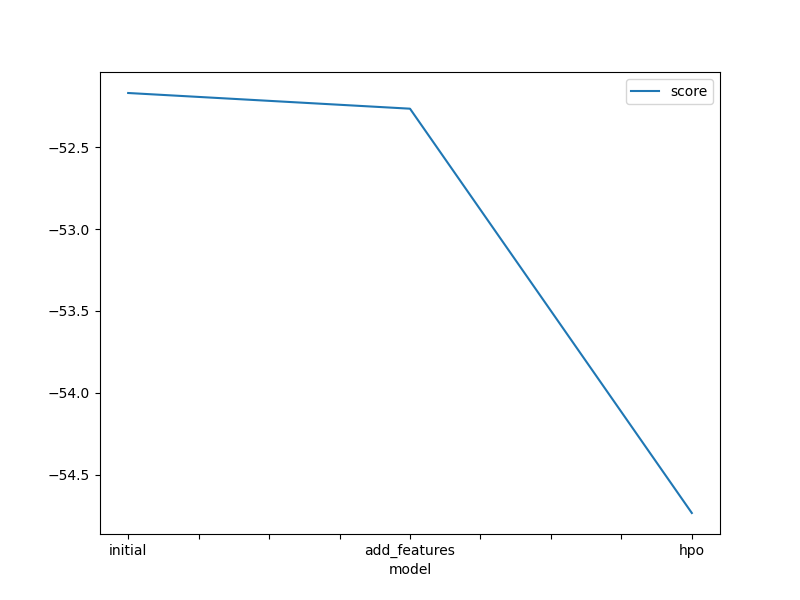
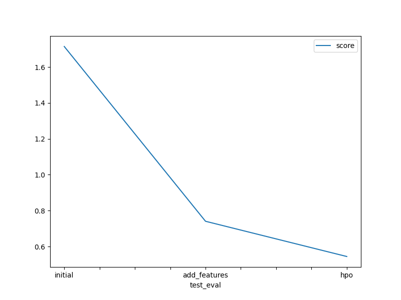

# Report: Predict Bike Sharing Demand with AutoGluon Solution
#### Vijayraj Kharod

## Initial Training
### What did you realize when you tried to submit your predictions? What changes were needed to the output of the predictor to submit your results?
The values needed to be positive, so I made all negative values 0.

### What was the top ranked model that performed?
The top ranked model was the `WeightedEnsemble_L3` model.

## Exploratory data analysis and feature creation
### What did the exploratory analysis find and how did you add additional features?
The exploratory analysis found that the `day`, `month` and `year` were important features. I added these features to the dataset.

### How much better did your model preform after adding additional features and why do you think that is?
The kaggle score improved from `1.71` to `0.74`. This is because the model was able to understand the datetime features better.

## Hyper parameter tuning
### How much better did your model preform after trying different hyper parameters?
After enabling auto_stack, the kaggle score jumped from `0.74` `0.55`.

### If you were given more time with this dataset, where do you think you would spend more time?
I would spend more time feature engineering, and trying to understand the data better.

### Create a table with the models you ran, the hyperparameters modified, and the kaggle score.
|model|boosting|feature|auto_stack|score|
|--|--|--|--|--|
|initial|gdbt|false|false|1.71439|
|add_features|gdbt|true|false|0.74074|
|hpo|dart|true|true|0.54444|

### Create a line plot showing the top model score for the three (or more) training runs during the project.

### Create a line plot showing the top kaggle score for the three (or more) prediction submissions during the project.

## Summary
In summary, I was able to improve the kaggle score for the bike share prediction from `1.71` to `0.54` by adding features and enabling auto_stack.
